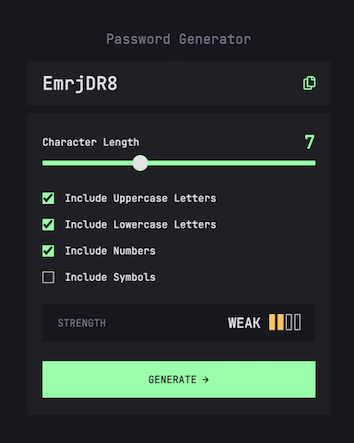
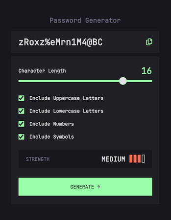
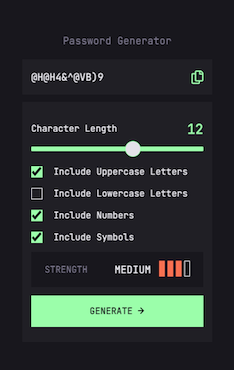

# Frontend Mentor - Password generator app solution

This is a solution to the [Password generator app challenge on Frontend Mentor](https://www.frontendmentor.io/challenges/password-generator-app-Mr8CLycqjh). Frontend Mentor challenges help you improve your coding skills by building realistic projects.

## Table of contents

- [Frontend Mentor - Password generator app solution](#frontend-mentor---password-generator-app-solution)
  - [Table of contents](#table-of-contents)
  - [Overview](#overview)
    - [The challenge](#the-challenge)
    - [Screenshot](#screenshot)
    - [Links](#links)
  - [My process](#my-process)
    - [Built with](#built-with)
    - [What I learned](#what-i-learned)
    - [Useful resources](#useful-resources)
  - [Author](#author)

**Note: Delete this note and update the table of contents based on what sections you keep.**

## Overview

### The challenge

Users should be able to:

- Generate a password based on the selected inclusion options
- Copy the generated password to the computer's clipboard
- See a strength rating for their generated password
- View the optimal layout for the interface depending on their device's screen size
- See hover and focus states for all interactive elements on the page

### Screenshot

### Links

- Solution URL: [EricWink GitHub](https://github.com/ericwink/FEM-Password-Generator)
- Live Site URL: [Password Generator](https://fem-password-generator.netlify.app/)

## My process

### Built with

- Semantic HTML5 markup
- CSS custom properties
- Flexbox
- [React](https://reactjs.org/)

### What I learned

This exercise allowed me to practice better problem solving techniques. Breaking down a large problem into smaller components, solving those and connecting the dots.

### Useful resources

- [Range Style Selector](http://danielstern.ca/range.css/?ref=css-tricks#/) - This tool by Daniel Stern is a much easier way to style a range input, which can be cumbersome to do from scratch.

## Author

- Website - [EricWink](https://github.com/ericwink)
- Frontend Mentor - [@ericwink](https://www.frontendmentor.io/profile/ericwink)
